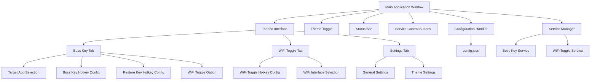
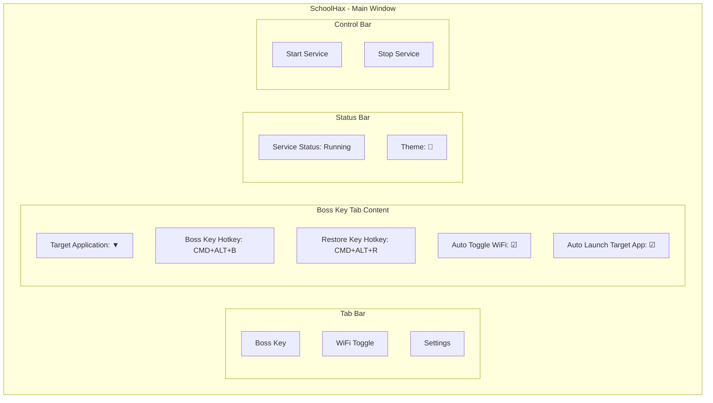

# SchoolHax GUI Development Plan

## Overview

This document outlines the plan for developing a graphical user interface (GUI) for the SchoolHax application, replacing the existing command-line interface. The GUI will be built using Tkinter to provide a clean, modern interface while maintaining the core functionality of the existing application.

## Requirements

- Implement both dark and light theme options with seamless switching capability
- Create an intuitive interface for configuring global hotkeys:
  - Bosskey activation hotkey
  - WiFi toggle hotkey
  - Bosskey restoration hotkey
- Provide clear controls to enable/disable the hotkey listening service
- Include a straightforward method for selecting and configuring the target application
- Allow users to specify whether WiFi should be automatically toggled when the bosskey is activated
- Support automatic launching of the target application if it's not already running

## Design Principles

- Prioritize simplicity and ease of use
- Ensure all settings are persistently saved
- Include appropriate visual feedback for user actions
- Maintain a consistent design language throughout the interface
- Support standard accessibility considerations

## GUI Architecture



## Detailed Component Breakdown

### 1. Core Application Structure

- **Main Window**: The primary container for all UI elements
  - Fixed size or resizable with minimum dimensions
  - Consistent padding and spacing
  - Modern look and feel with proper margins

- **Theme Management**:
  - Dark and light mode support
  - Toggle control in a prominent location
  - Immediate application of theme changes
  - Persistent theme selection across sessions

- **Tabbed Interface**:
  - Clean, uncluttered tab design
  - Visual indicator for active tab
  - Consistent content layout within tabs
  - Proper spacing between elements

- **Service Control**:
  - Start/stop buttons for the hotkey listening service
  - Visual status indicator
  - Clear feedback when service status changes

### 2. Boss Key Tab

- **Target Application Selection**:
  - Dropdown list showing running applications
  - File browser button to select applications not currently running
  - Option to launch target application if not running
  - Visual indicator showing the current target app status (running/not running)

- **Hotkey Configuration**:
  - Interactive boss key hotkey selector with clear visual feedback
  - Interactive restore key hotkey selector with clear visual feedback
  - Visual representation of currently configured hotkeys
  - Reset to default buttons

- **Behavior Options**:
  - WiFi toggle checkbox with clear labeling
  - Other behavior customization options
  - Immediate application of settings changes

### 3. WiFi Toggle Tab

- **WiFi Interface Management**:
  - Interface selection dropdown populated with available WiFi interfaces
  - Status indicator showing current WiFi state
  - Manual toggle button for testing
  - Interface information display

- **Hotkey Configuration**:
  - Interactive WiFi toggle hotkey selector
  - Visual representation of currently configured hotkey
  - Reset to default button

### 4. Settings Tab

- **General Application Settings**:
  - Start on login option
  - Minimize to system tray option
  - Other general behaviors

- **Theme Configuration**:
  - Light/dark theme selection radio buttons or toggle
  - Preview of selected theme

### 5. Backend Services

- **Service Manager**:
  - Centralized management of background services
  - Status monitoring and reporting
  - Graceful startup and shutdown
  - Error handling and recovery

- **Configuration Handler**:
  - Read/write configuration to a unified config.json
  - Migration of existing configurations
  - Validation of settings
  - Default values when needed

- **Event Listeners**:
  - Global hotkey monitoring
  - System event handling
  - Application state changes

## UI Design Mockup



## Implementation Plan

### Phase 1: Project Setup and Base UI Framework

1. Create a new Python module structure
   - Set up folder hierarchy
   - Create necessary __init__.py files
   - Configure imports

2. Set up Tkinter with theme support
   - Implement ttk theming
   - Create custom styles
   - Define color schemes for light and dark modes

3. Implement the main window and tabbed interface skeleton
   - Create the main application window
   - Add tabbed interface
   - Create empty containers for each tab's content
   - Add status bar and control buttons

4. Create the configuration handler to manage a unified `config.json`
   - Define configuration schema
   - Implement read/write functionality
   - Add migration from existing config files
   - Add validation logic

### Phase 2: Core Functionality Migration

1. Extract and adapt the boss key logic from `boss_key.py`
   - Separate the core functionality from UI logic
   - Adapt to work within the Tkinter application
   - Ensure compatibility with PyObjC

2. Extract and adapt the WiFi toggle logic from `wifi_toggle.py`
   - Separate the core functionality from UI logic
   - Adapt to work within the Tkinter application
   - Ensure compatibility with PyObjC

3. Implement the service manager to control both functionalities
   - Create a unified service control mechanism
   - Implement status management
   - Add error handling and recovery

4. Develop the hotkey configuration UI components
   - Create custom widgets for hotkey selection
   - Implement real-time feedback
   - Add validation logic

### Phase 3: Additional Features and UI Refinement

1. Implement the target app selection and auto-launch functionality
   - Create UI for selecting applications
   - Implement logic to check if the app is running
   - Add automatic launching capability

2. Add theme switching capability with appropriate styling
   - Create consistent styling across all components
   - Ensure smooth theme transitions
   - Save theme preference

3. Create status indicators and visual feedback mechanisms
   - Add clear status indicators
   - Implement tooltips
   - Add notification mechanisms

4. Develop persistent settings storage
   - Ensure all settings are saved to config
   - Add automatic loading on startup
   - Implement change detection

### Phase 4: Testing and Refinement

1. Test all functionality across different macOS versions
   - Verify compatibility
   - Test edge cases
   - Validate permissions handling

2. Optimize UI responsiveness
   - Ensure the UI remains responsive during operations
   - Optimize resource usage
   - Handle long-running operations properly

3. Implement error handling and user feedback
   - Add comprehensive error dialogs
   - Provide helpful guidance for resolving issues
   - Log errors for troubleshooting

4. Refine the installation and setup process
   - Document requirements
   - Streamline first-run experience
   - Automate permission requests where possible

## Technical Considerations

### Configuration Management

The existing configuration is split between separate JSON files. We'll need to:
- Create a unified configuration structure
- Implement migration from existing config files
- Ensure backward compatibility
- Handle configuration version upgrades

### Hotkey Implementation

We'll reuse the existing hotkey parsing and event handling code but adapt it to:
- Integrate with Tkinter's event loop
- Provide visual feedback in the UI
- Support real-time hotkey changes
- Validate for conflicts

### PyObjC Integration

We'll need to maintain the PyObjC functionality while:
- Ensuring it works correctly within the Tkinter application
- Handling potential threading issues
- Managing permissions appropriately
- Providing fallback mechanisms for failures

### Auto-launch Feature

For the new automatic target app launching feature, we'll:
- Use `NSWorkspace` to check if the app is running
- Implement AppleScript to launch the app if needed
- Provide appropriate user feedback
- Handle application launch failures

## File Structure

```
SchoolHax/
├── app.py                 # Main entry point
├── config.json            # Unified configuration file
├── gui/
│   ├── __init__.py
│   ├── main_window.py     # Main window implementation
│   ├── boss_key_tab.py    # Boss key UI components
│   ├── wifi_toggle_tab.py # WiFi toggle UI components
│   ├── settings_tab.py    # Settings UI components
│   ├── theme_manager.py   # Theme handling
│   └── components/        # Reusable UI components
│       ├── __init__.py
│       ├── hotkey_selector.py
│       ├── app_selector.py
│       └── status_bar.py
├── services/
│   ├── __init__.py
│   ├── service_manager.py # Service control
│   ├── boss_key.py        # Boss key functionality
│   ├── wifi_toggle.py     # WiFi toggle functionality
│   └── hotkey_monitor.py  # Global hotkey monitoring
└── utils/
    ├── __init__.py
    ├── config_handler.py  # Configuration management
    └── system_utils.py    # macOS system interactions
```

## Next Steps

1. Create the project structure and base files
2. Set up the core UI framework
3. Begin implementing the configuration handler
4. Start adapting existing functionality into the new structure